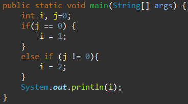
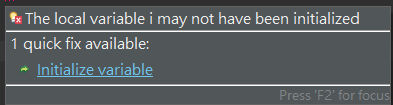

<h1>20240910 筆記</h1>

一、初始化設定 -

1. Class variable: 會自動初始化(歸零)
2. Function variable: 不會自動初始化，一定要手動賦值
3. 開頭就算宣告了 long a = 300; ， a 還是 被當為 int， 需要改為 a = 300L。 

二、邏輯完整性 - 

1. Java 只會根據語句判斷是否有邏輯的失誤，像下圖會編譯失敗



改回 if - else 的寫法才能通過

三、指派 - 

Java 有指派，但沒有指派運算子(已廢棄)，
```java
1. a = 100;
2. a = b;
3. a = a + b;
4. a = Math.random();
5. Fool a = new Fool();
```
都是指派的一種，其中 a = b 會直接複製b給 a 並在各佔據獨立的記憶體空間，意即 a = b 會導致記憶體被佔用了 2 個 a 的空間 

四、Java 單一介面的 Pass by Value -

當同一個物件被指派到不同變數時，比如:
```java
a = new Fool();
b = a;
```
此時 a 與 b 都指向相同的物件，使用 a.setValue(5); 與 b.setAns(2); 時都是修改同一個物件內容


五、使用 commend 執行 java 與 javac 的編譯時，commend 需要置於在套件的進入點 - 

(比如 import com.uuu.kkk，而 uuu 在 src 資料夾下，那麼commend 的位置就要在 src)


六、將Java打包成.jar - 

1. 設定系統變數JAVA_HOME
2. 在PATH內，設定%JAVA_HOME%\bin
3. 建立txt檔，並設定 Main-Class: com.systex.main.TestProduct (最後面要換一行)
4. cmd jar -c --file fool.jar(生成的.jar名稱) --manifest fool.txt(文字檔名稱)

七、Main進入點傳值
public void Main(String args[]) 中的 args 可由進入點先給值，
比如 java com.systex.main.TestPoint 20 就會對main傳值，
