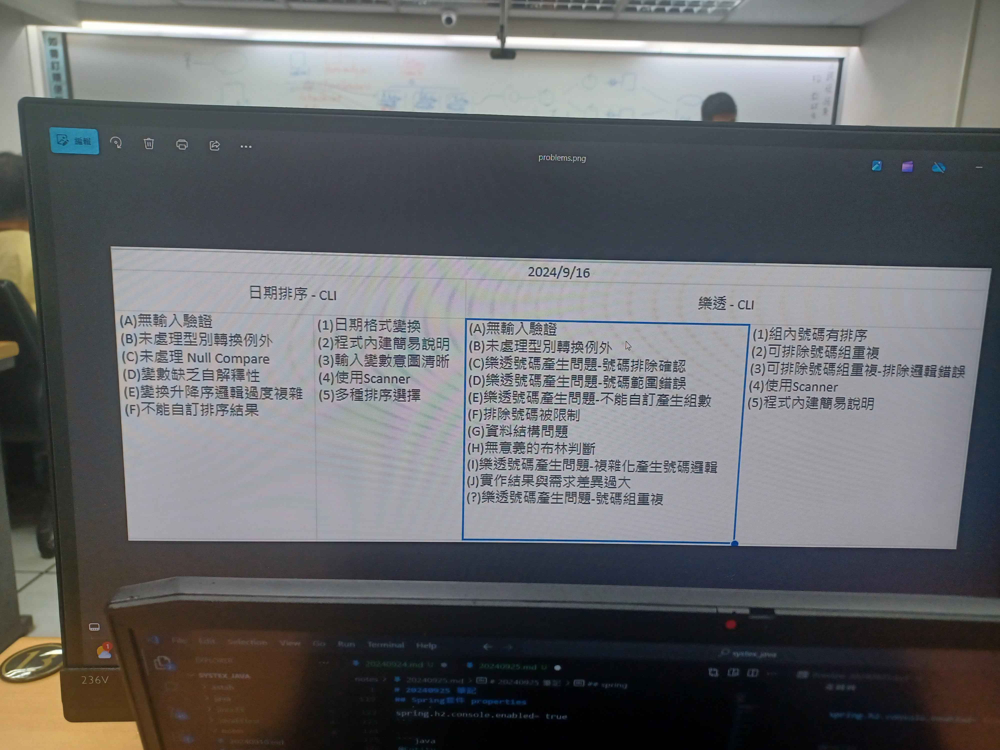

# 20240930 作業

1. 樂透改Spring
2. 登入功能
3. bootstrap

## Todo

1. 限制並驗證傳入參數(new Bingo)
2. 現在並驗證傳入參數(new Bingo.writebingo)
3. 設定exception(給user看的)
3. 撰寫Bingo.jsp
4. 設定spring controller
5. 獲取api並互相傳值( jsp <-> controller)
6. 撰寫登入entity 
7. 撰寫登入邏輯+驗證
8. 登入頁面製作並互相傳值
9. 未登入前攔截其他頁面請求(阻擋所有的頁面，只留index)
9. 
9. 新建帳號頁面製作
10. 登入密碼加密設定
11. 頁面美化(bootstrap)
12. 確認結果與程式碼簡化



Learn 
1. Post??|cURL (http請求發送)
2. servlet 架構 (與dispatcherSevlet完全不同)
```
servlet 負責接收 server(tomcat)轉送的請求

```

除錯
1. 使用外部server時，需要新增`SpringBootServletInitializer`
```java
public class demoApplication extends SpringBootServletInitializer {

}